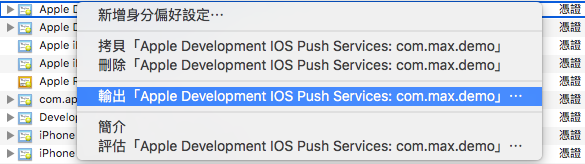

# readme

- 目的 : 一切都為了簡化 APNS 憑證，建立的問題，因 php/python 需用 .pem 來與 APNS 進行驗證，故利用簡易的 tool 透過 openssl 將 .p12 -> .pem，並達到基本測試效果
- 可與 [apnsReceiver](https://github.com/jhaoheng/apnsReceiver) 聯合測試
	- 接收訊息
	- 判斷此 token 是哪一種憑證建立，並對應到適當的 pem，進行發送

## required
- openssl 1.0.1 or later : `openssl version`
- curl support http2 : `curl -V`

## 解決問題

0. 收納憑證
1. 建立憑證
2. 測試憑證
	- Apple Push Notification service SSL (Sandbox)
	- Apple Push Notification service SSL (Sandbox & Production) : 新的 production 的 apns cer 包含 Sandbox & Production
3. 測試 apns server
4. 測試推播 : 要求安裝 curl with http2 
	- install(mac) : 
		- `brew install curl --with-nghttp2` 
		- `brew link curl --force`

## How to use

1. 專案環境建立，可參考 /drawer/sample 檔案內容
	1. 在 `drawer/`，建立 [專案名稱]
	2. 在 [專案名稱] 下，建立 dev 與 pro 資料夾
	3. 在 dev / pro 放入檔案
		- dev -> save as `developKey.p12`
		- pro -> save as `proKey.p12`
		- from keychain, output **p12** file from **Apple Developemnt IOS Push Service: [bundle_id]** 
2. 開啟 cmd，執行 `sh main.sh`
3. 選擇 (1) : **Create 'PEM'**
	1. 輸入專案名稱
	2. 輸入 dev 或 pro

## How to TEST the created PEM

1. `sh main.sh`
2. 選擇 2(dev) or 3(pro)
3. 若錯誤，則會產生錯誤訊息
	- ex : 憑證錯誤，無法跟伺服器產生交握 => `unable to load client certificate private key file` or `unable to load certificate`
	- ex : 將 dev 的憑證，丟給 api.push.apple.com:443 => 錯誤訊息 `{"reason":"BadCertificateEnvironment"}`
4. 若憑證授權錯誤，則

## Feature

1. 根據分類的專案，來進行 pem 憑證的建立
2. 根據 sandbox pem 的建立後，進行 openssl 的測試連接
3. 根據 production pem 的建立後，進行 openssl 的測試連接
4. Test your computer to connect APNS, the channel is working
5. If you don't know how to create 'APNS certificate', check out!(website)
6. Troubleshooting Push Notifications(website)
7. 產生 curl 測試 push 指令
	- required : https://curl.haxx.se/docs/http2.html
	- install(mac) : 
		- `brew install curl --with-nghttp2` 
		- `brew link curl --force`


## 產生憑證指令

### method_1


1. develop.cer : from develop center, download **SSL Certificate** file from **Push Notifications**
2. developKey.p12 : from keychain

```
openssl x509 -in [develop].cer -inform der -out [cer].pem
openssl pkcs12 -nocerts -out [key].pem -in [developKey].p12
cat [cer].pem [key].pem > [final].pem
```


### method_2

1. output key : from keychain
	

2. 產生憑證

	```
	openssl pkcs12 -in [developKey].p12 -out [cer].pem -nodes -clcerts
	```